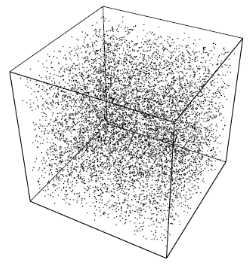

# Modelsim-Mersenne-Twister
 
This repository shows how to generate a strong **64bits pseudo random number (MT19937-64)** in Modelsim using the VHDL **Foreign Language interface** (FLI). Changing the design for Verilog and the DPI/PLI/VPI should be straightforward.



 
*Illustration of equidistribution property: random points*

For the random number generator the **Mersenne Twister** algorithm is used which was developed by [Makoto Matsumoto](http://www.math.sci.hiroshima-u.ac.jp/m-mat/eindex.html) and Takuji Nishimura back in 1997. The Mersenne Twister name is derives from the fact that its period length is chosen to be a Mersenne prime. The Mersenne Twister was designed specifically to rectify most of the flaws found in older PRNGs. The most commonly used version of the Mersenne Twister algorithm is based on the Mersenne prime 2^(19937 − 1). The standard implementation of that, MT19937, uses a 32-bit word length. There is another implementation (with five variants[3]) that uses a 64-bit word length, MT19937-64; it generates a different sequence. [source wikipedia](https://en.wikipedia.org/wiki/Mersenne_Twister)

## Requirements
1) 64bits Modelsim DE (or Questa), Modelsim PE users need to install 64bits Modelsim DE (works on a PE license)
2) Either Visual Studio 2019 (free community edition) or the Modelsim supplied gcc compiler

## Check before building

1) Make sure the Modelsim installation root directory is set via the **MTI_HOME** environmental variable. This is required because the run.bat file uses %MTI_HOME%/include and %MTI_HOME%/win64pe.

```
E:\Modelsim-Mersenne-Twister>echo %MTI_HOME%
D:\Products\modelsim_de_2022
```

2) The 64bits Visual Studio compiler or gcc (*<modelsim_install_directory>\gcc-7.4.0-mingw64vc15\bin*) is added to the search PATH

```
call "C:\Program Files (x86)\Microsoft Visual Studio\2019\Community\VC\Auxiliary\Build\vcvarsall.bat" x86_amd64

E:\Modelsim-Mersenne-Twister>cl /?
Microsoft (R) C/C++ Optimizing Compiler Version 19.29.30137 for x64
Copyright (C) Microsoft Corporation.  All rights reserved.

E:\Modelsim-Mersenne-Twister>gcc --version
gcc (GCC) 7.4.0
Copyright (C) 2017 Free Software Foundation, Inc.
This is free software; see the source for copying conditions.  There is NO
warranty; not even for MERCHANTABILITY or FITNESS FOR A PARTICULAR PURPOSE.
```


## Build FLI DLL
To build the FLI DLL and run the simulation open a CMD prompt and execute either **run_cl.bat** for Visual Studio or **run_gcc.bat** for gcc. This should produce **fli_mt.dll** and the give the following Modelsim output:

```
E:\Modelsim-Mersenne-Twister>cl -c /Zi -I D:\Products\modelsim_de_2022\include src/fli_mt.c
Microsoft (R) C/C++ Optimizing Compiler Version 19.29.30137 for x64
Copyright (C) Microsoft Corporation.  All rights reserved.

fli_mt.c

E:\Modelsim-Mersenne-Twister>link -dll -export:get_rand64 -export:init_genrand64 fli_mt.obj D:\Products\modelsim_de_2022\win64pe\mtipli.lib /out:fli_mt.dll
Microsoft (R) Incremental Linker Version 14.29.30137.0
Copyright (C) Microsoft Corporation.  All rights reserved.

   Creating library fli_mt.lib and object fli_mt.exp

E:\Modelsim-Mersenne-Twister>vcom -nostats -quiet -2008 rtl\tb.vhd

E:\Modelsim-Mersenne-Twister>vsim -nostats -quiet tb -c -do "run 100 ns; quit -f"
Reading pref.tcl

# 2022.1
# //  ModelSim DE-64 2022.1 Jan 29 2022
# //
# //  Copyright 1991-2022 Mentor Graphics Corporation
# //  All Rights Reserved.
# //
# //  ModelSim DE-64 and its associated documentation contain trade
# //  secrets and commercial or financial information that are the property of
# //  Mentor Graphics Corporation and are privileged, confidential,
# //  and exempt from disclosure under the Freedom of Information Act,
# //  5 U.S.C. Section 552. Furthermore, this information
# //  is prohibited from disclosure under the Trade Secrets Act,
# //  18 U.S.C. Section 1905.
# //
# run 100 ns
# ** Note: MT=0xBB4104472F70AC1B
#    Time: 10 ns  Iteration: 0  Instance: /tb
# ** Note: MT=0x966DF95362CD7F3F
#    Time: 20 ns  Iteration: 0  Instance: /tb
# ** Note: MT=0x8AB632AE01DFCA1A
#    Time: 30 ns  Iteration: 0  Instance: /tb
# ** Note: MT=0x466D26715F17F939
#    Time: 40 ns  Iteration: 0  Instance: /tb
# ** Note: MT=0x2857867C6AA12F7B
#    Time: 50 ns  Iteration: 0  Instance: /tb
# ** Note: MT=0xD1D6442BF97F0B3F
#    Time: 60 ns  Iteration: 0  Instance: /tb
# ** Note: MT=0x422A11117979E7BD
#    Time: 70 ns  Iteration: 0  Instance: /tb
# ** Note: MT=0x209A4FE2F7954F5B
#    Time: 80 ns  Iteration: 0  Instance: /tb
# ** Note: MT=0xCA28F798E1B1C032
#    Time: 90 ns  Iteration: 0  Instance: /tb
# ** Note: MT=0x31D75B0256BE6DD0
#    Time: 100 ns  Iteration: 0  Instance: /tb
#  quit -f

```


## License

see the LICENSE file for details, the Mersenne Twister license can be found in the src/fli_mt.c header.

## Notice
ModelSim®, Questa, QuestaSim and their respective logos are trademarks or registered trademarks of Siemens Industry Software Limited.
